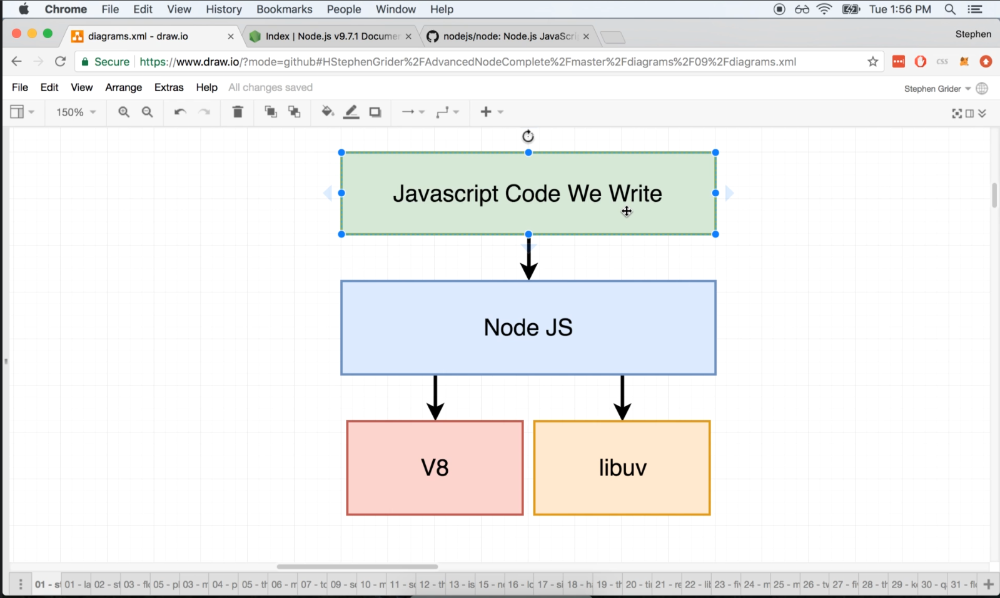
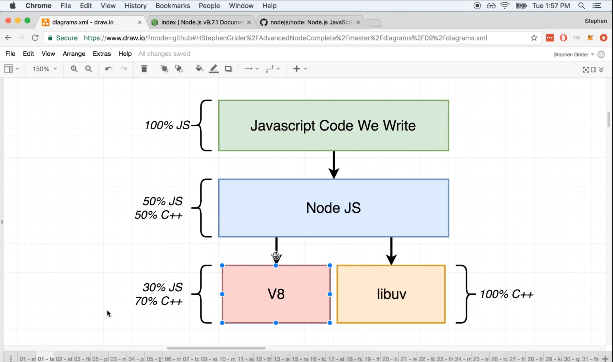
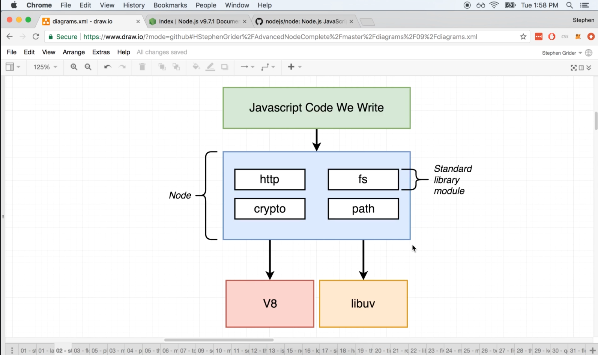

# DEV-01: Starting with Node Internals 

## Tags: []

## Links: <https://www.udemy.com/course/advanced-node-for-developers/learn/lecture/9636084#overview>

## Nodejs

    Node.js internally has a collection of dependencies that it uses to actually execute your code
    Two of the most important dependencies are V8 project and the libuv project.

## V8 Project

    The V8 project is an open source Javascript engine created by Google.
    The purpose of this project is to be able to execute Javascript code outside
    of the browser. This is what we currently do when we run Javascript code
    outside from the terminal

## Libuv Project

    The libuv project is a C++ open source project that gives Node.js access to operating systems
    File Systems
    Networking
    Some concurrency as well

## What is the purpose on Node.js

    OK, so we got one module right here that gives us access to the file system and networking
    and other one right here that actually executes our JavaScript code. Then what is the 
    purpose of Node.js?

### Purpose 1

    Chances are that you as a Javascript dev, dont want to be writing C++ code.
    Node.js gives us a nice interface to use to relate our Javascript side
    of our application to actual C++ thats running on our computer to actually interpret 
    and execute our JS code.

### Purpose 2

    Node.js provides a series of wrappers and a very unified and consistent API for us to use inside our projects.
    All these modules right here have very consistent APIs and they all ultimately refer to a functionality that 
    is mostly implemented inside of the libuv project.

