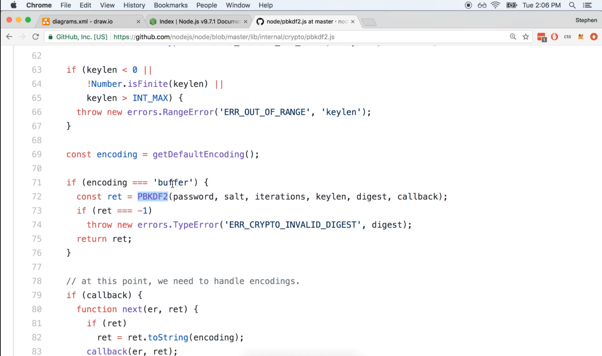
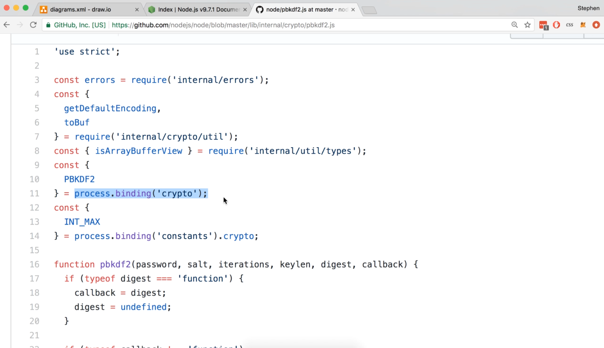
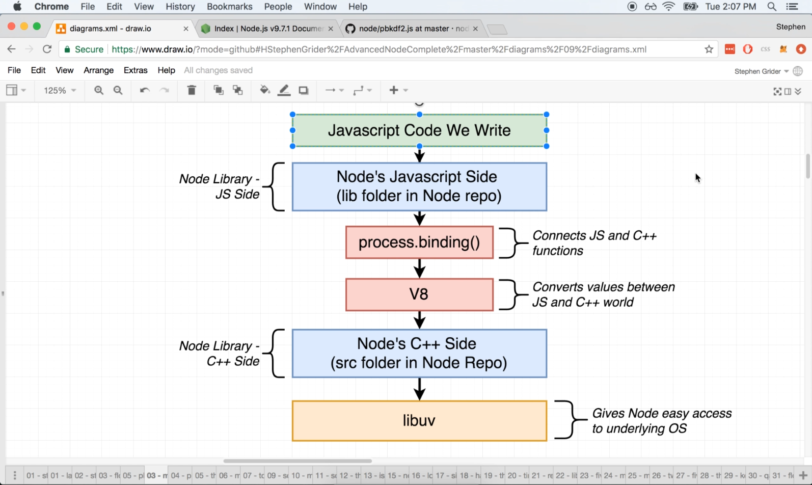

# DEV-02: Module Implementations Part 1

## Tags: []

## Links: <https://www.udemy.com/course/advanced-node-for-developers/learn/lecture/9636088#overview>

## What is node.js doing?

    Essentially, node.js takes all the inputs you provide, for example in this module called crypto, there is this function called pbkdf2, and 
    javascript pbkdf2 forwards to the C++ implementation of this function.

## How does it connect with C++ code?

    Line 11 below is how node.js joins up with the c++ side of its project to the Javascript side

