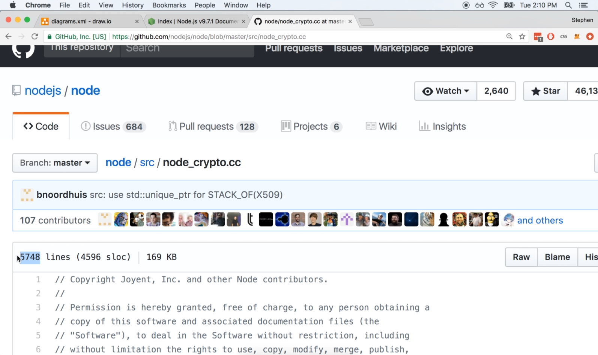
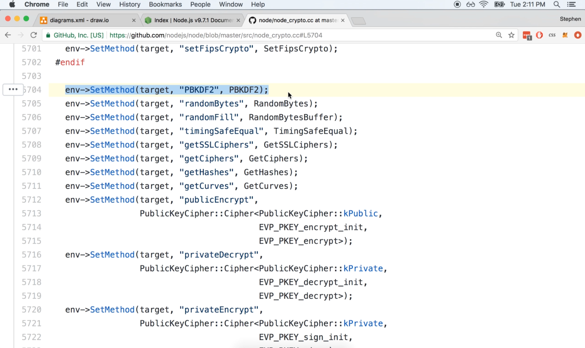
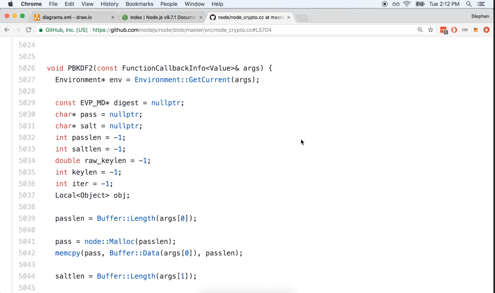
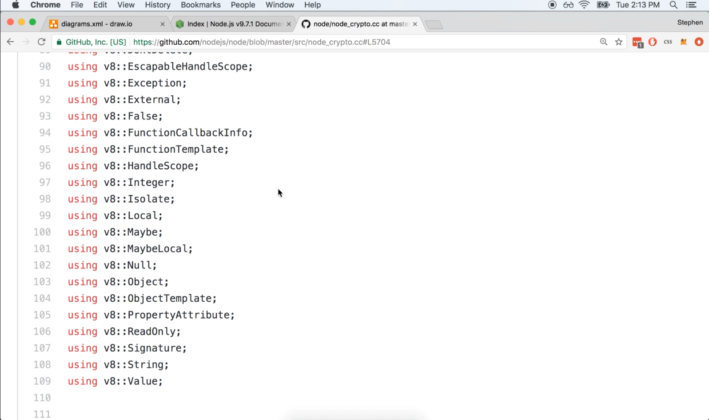
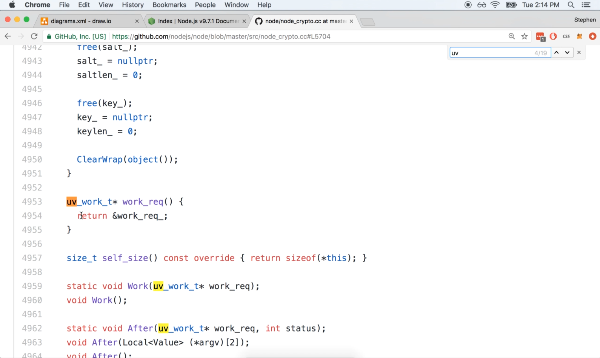

# DEV-03: Module Implementations Part 2

## Tags: []

## Links: <https://www.udemy.com/course/advanced-node-for-developers/learn/lecture/9636092#overview>

## How does process.binding() work?

    This is where the real implementation of the logic resides.
    This is all the C++ code that the crypto module actually depends upon.

### The File

### The Export Statment

    This is essentially a C++ export statement.

### The real PBKDF2 function

## The V8 Project

    The V8 project is used to translates the node.js values that we place inside of our different programs,
    like a boolean or a function or an object and translate it into their C++ equivalents.

## Libuv Project

    Libuv is present in here as well, doing things like concurrency and processing constructs on the C++ side.

