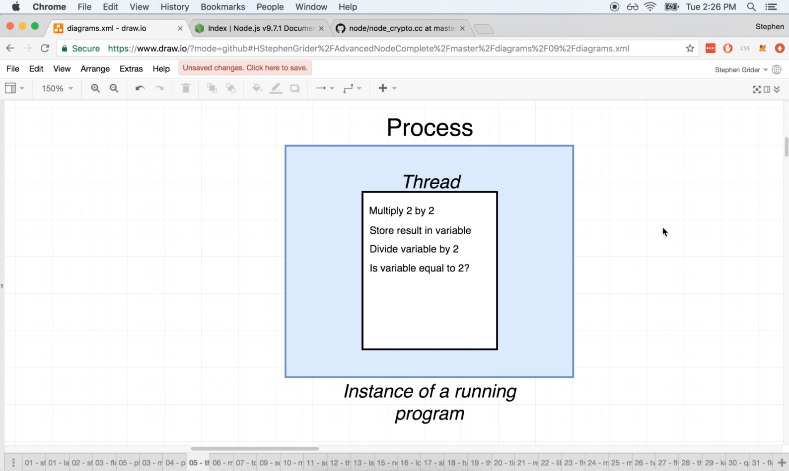
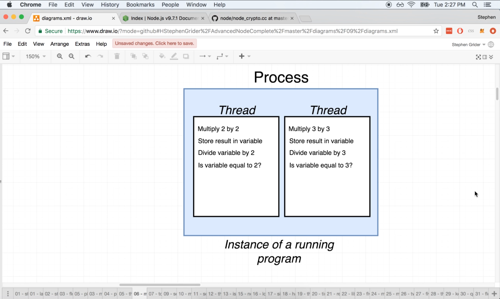
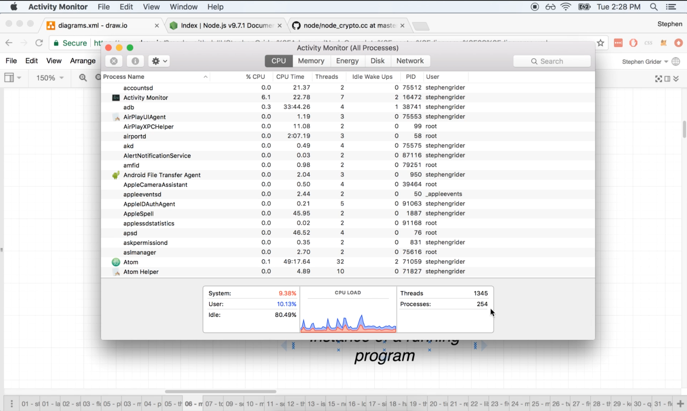
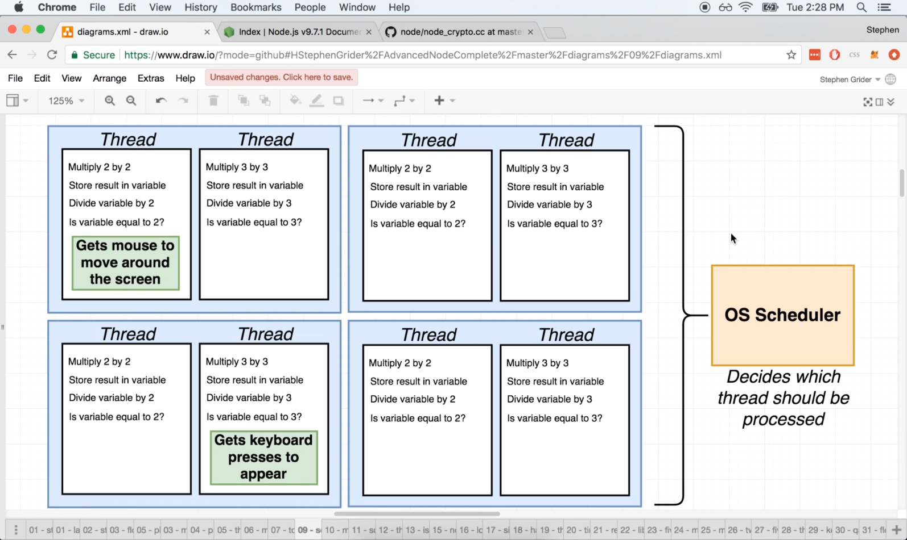
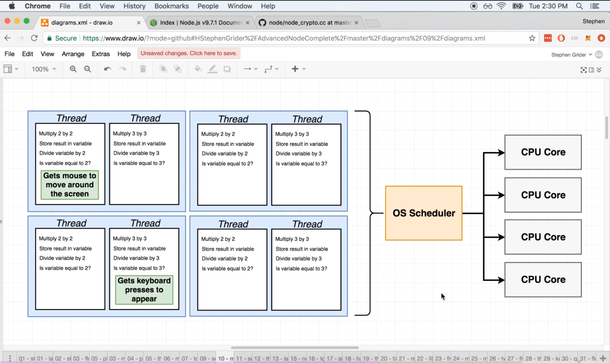
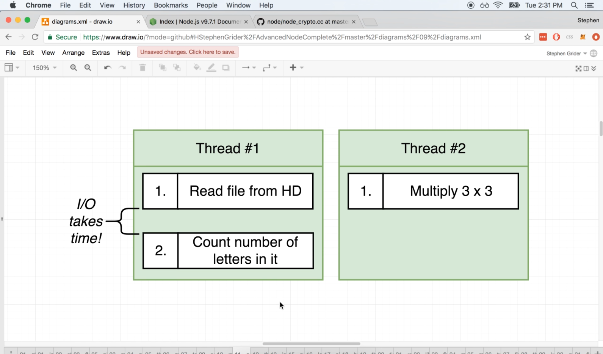

# DEV-04: The Basics of Threads

## Tags: []

## Links: <https://www.udemy.com/course/advanced-node-for-developers/learn/lecture/9636098#overview>

## What is the event loop?

    The event loop is used by node to handle asynchronous code that you and I 
    write inside of our application.

## What is a thread?

    Whenever we programs on our on our computer, we start up something called a process.
    A process is an instance of a computer program that is being executed within a single process.

    A thread is a unit of instruction that is waiting to be executed by the CPU
    Within a single prcess, we can have multiple things called threads. You can picture a thread
    as little todo list that has some number of instructions that need to be executed by the CPU.

    The thread is given to the CPU and the CPU will attempt to run every instruction on it one by one.

## Multiple Threads

    A single process can have multiple threads inside of it

## What is Scheduling?

    Scheduling refers to your operating systems ability to decide which thread to process at any given instant.
    So remember, your computer has a limited amount of resources available to it.
    
    Your CPU can only process so many instructions per second.
    This starts to get really relevant when we have many active processes and threads on our computer.

    So your operating systems scheduler over here has to look at all these different threads that are asking
    to be processed and figure out how to do some amount of work on each of them while making sure that
    they don't have to wait too long to be processed.

## Cores

    So if we have more than one core inside of our CPU, then we can easily process multiple threads at
    the same time.

    One thing I want to mention here is that technically one core can process more than one thread at a
    time through a process called multi threading.

## Power of the Scheduler

    The thing to keep in mind is that any time our computer tries to read data off of some type of medium,
    like a hard drive, we refer to that as input or output operations, and it always takes some non-zero
    amount of time.

    So during this IO phase right here, your CPU is waiting on the hard drive to read some file and return
    its contents.

    Your operating system scheduler has the ability to detect this downtime or this kind of pause between
    instructions, and it can decide to put thread number one on pause and then execute thread number two.
    And then as soon as the read number two is complete, it can go back over to threat number one and continue
    waiting on the hard drive to be read from the person to the file, to be read from the hard drive.