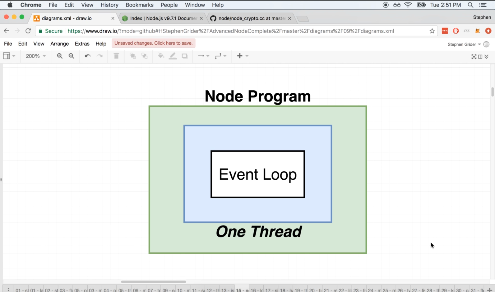
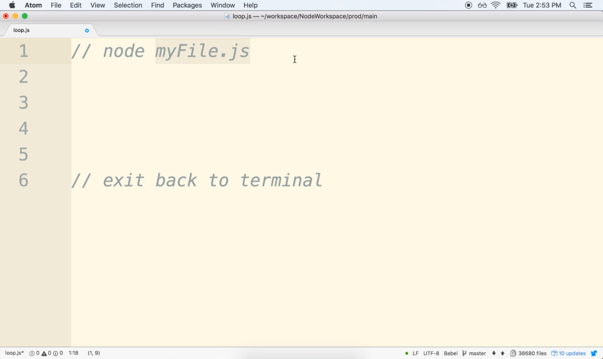
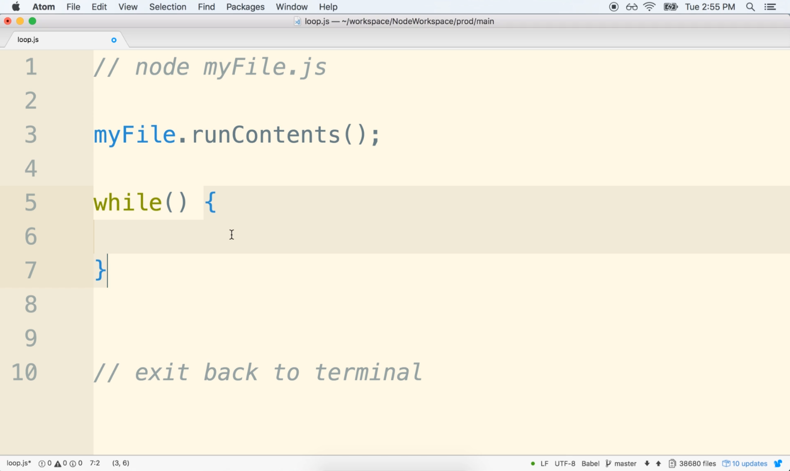
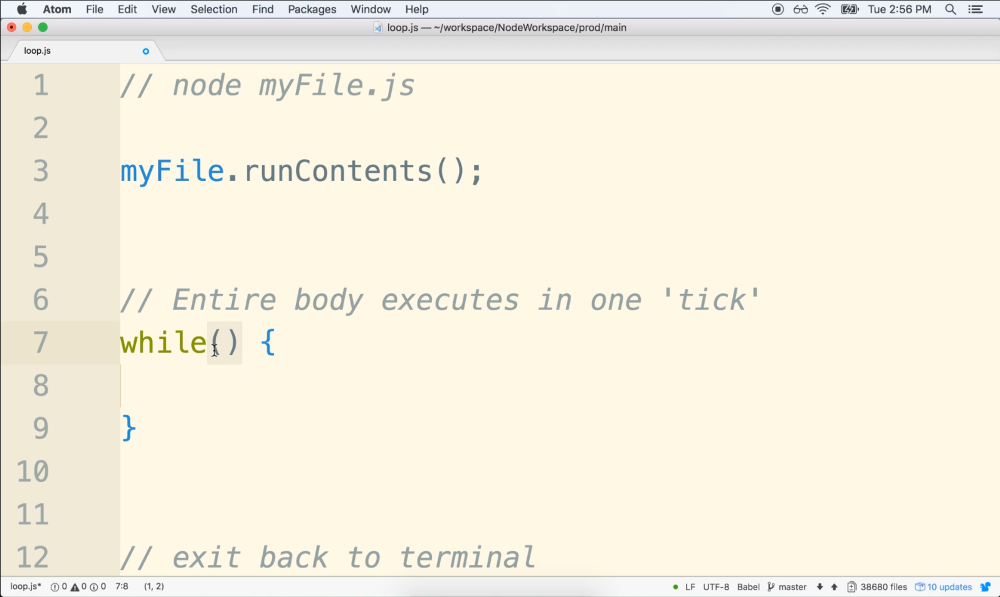
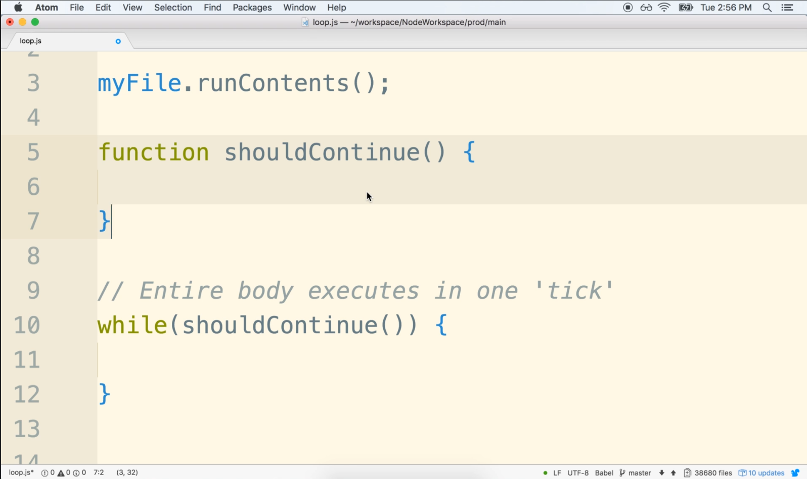

# DEV-05: The Node Event Loop Part 1

## Tags: []

## Links: <https://www.udemy.com/course/advanced-node-for-developers/learn/lecture/9636100#overview>

## What is the event loop

    Whenever we start up a program in node.js. Node creates one single thread and executes all of our code in that one single thread.

    Similar to a scheduler, You can think of the event loop as being like a control structure that decides what our one thread should
    be doing at any given point in time.

    And every program that you and I run has exactly one event loop.
    Understanding how the event loop works is extremely important because a lot of performance concerns
    about node boiled down to eventually how the event loop behaves.

## Node Application Life Cycle

    Right here the event loop does not immediately get executed

    Instead, at the very at the very start, like when we first invoke node and feed in a file node, takes
    the contents of this file right here, the contents of my file charges, and it executes all the code.

    Pretending that the event loop is a while loop here:

This event loop right here or this while loop essentially is going to execute again and again and again.
Every single time the event loop runs inside of our node application, we refer to that as one tick.

Now, you and I very well know every while loop that we ever write has to have some type of condition
tied to it.

We put that condition inside this set of parentheses.
And whenever that condition returns false, the wire loop is no longer going to execute.
That same idea applies to the event loop as well.

So every single time that the event loop is about to execute node first does a quick check to decide
whether or not it should allow the loop to proceed for another iteration.

If no decides that the loop should not be entered or it should not be executed again, then the body
of the entire event loop gets skipped.
Or in our program, the body of the wire loop gets skipped and the program exits back to the terminal,

