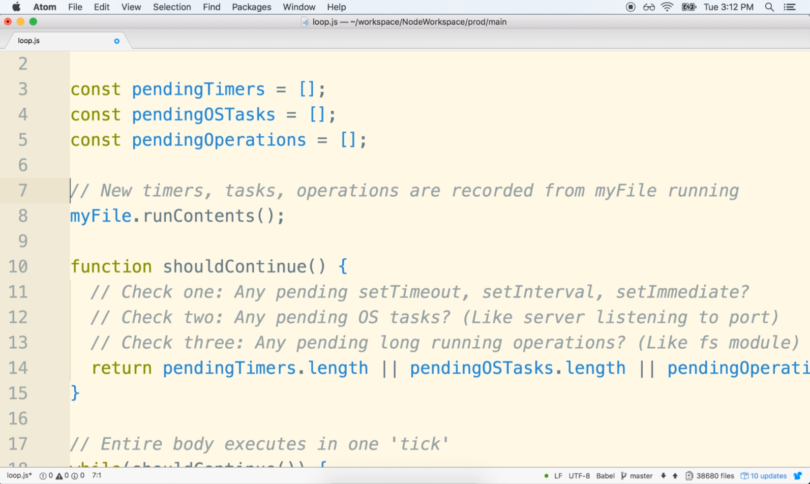

# DEV-06: The Node Event Loop Part 2

## Tags: []

## Links: <https://www.udemy.com/course/advanced-node-for-developers/learn/lecture/9636102#overview>

## Conditions for the Event loop

### First Check

    The first check that Node.js does when it decides whether it should continue running our program
    is to see if there are still any functions that have beem registered with:
    - setTimeout
    - setInterval
    - setImmediate

    That still need to be executed. If so then the eventloop continues for another tick

### Second Check

    The second check that Node.js does is to decide whether or not to exit is to look up to see
    if there are any pending operating system tasks:
    - HTTP server listening to requests at some port

### Third Check

    The third check that Node.js does is see if there are any long running operations that are still being executed
    within our program. This is similar to the second check. but there is a distinct difference between them.
    examples inlcude:
    - Reading files with fs module

## How does the Event loop know these things infact are going on?

    We can kind of imagine that there might be like an
    internal array of sorts inside of our node program that keeps track of any of these pending tasks that
    might be created.

    So maybe any time that our JavaScript code creates a new set time out or makes a new call to the first
    module, maybe an entry is added to some array to keep track of that task that is currently being executed.

