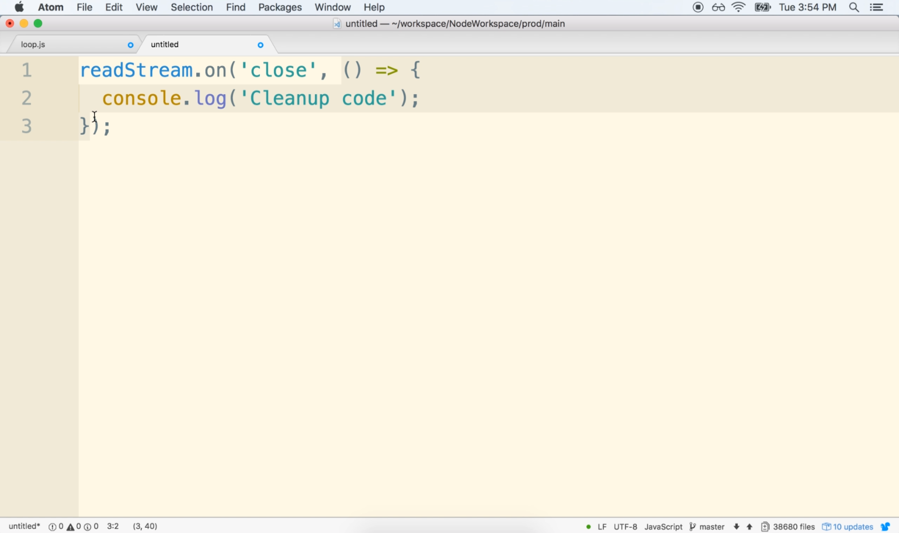

# DEV-07: The Node Event Loop Part 3 (Ticks)

## Tags: []

## Links: <https://www.udemy.com/course/advanced-node-for-developers/learn/lecture/9636104#overview>

## What does the Event Loop itself Do?

### First Step

    Node looks at pendingTimers and sees if any functions are ready to be called. Explicitly setInterval and setTimeout.

    So the very first thing that occurs is node looks at that array of pending timers and it looks at all
    the different functions that have been passed to set time out and set interval if any of those timers
    have expired.

    The node calls the relevant callbacks associated with each one.

### Second Step

    Node looks at pending OS tasks and pending operations and calls relevant callbacks.

    node will detect that those things have been completed and it will call the relevant callbacks like the callback to receive
    a file that's been fetched or a callback to handle an incoming request.

### Third Step

    Node pauses execution temporarily.
    It just sits 
    And it waits for new events to occur.
    
    Continue When:
    - a new pendingOSTask is done
    - a new pendingOperation is done
    - a timer is about to complete

    Remember that if you and I rode out a while loop inside of JavaScript code and wrote in like, say,
    while true right here, you know, something like this, that while Loop would execute as fast as it
    possibly could, and that's not actually what occurs inside the event loop.

## Fourth Step

    Node looks at pendingTimers and sees if any functions are ready to be called. Explicitly setImmediate.

## Fifth Step

    Handle any 'close' events

    Essentially, this last step inside the event loop is about just handling cleanup code and cleaning
    up after ourselves and making sure that we don't have any dangling loose ends inside of our program.

## To close

All this This occurs during every single tick that occurs.

