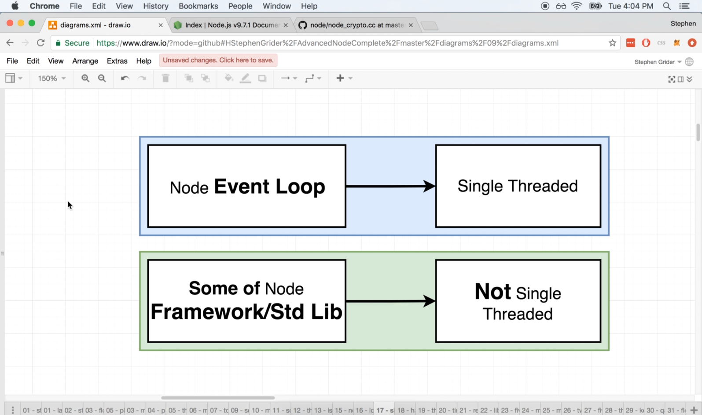
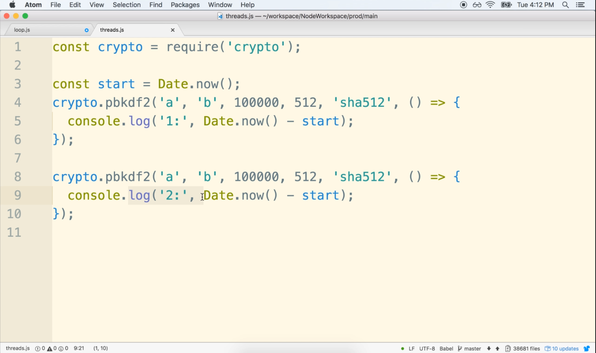
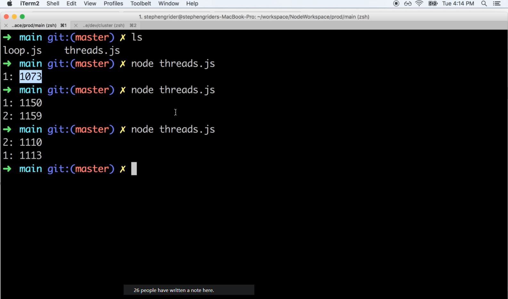
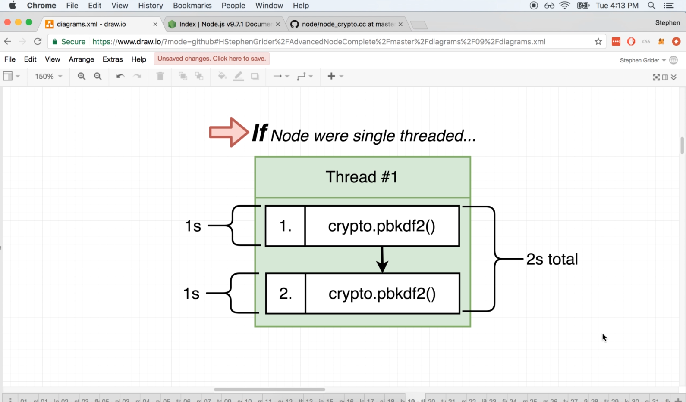
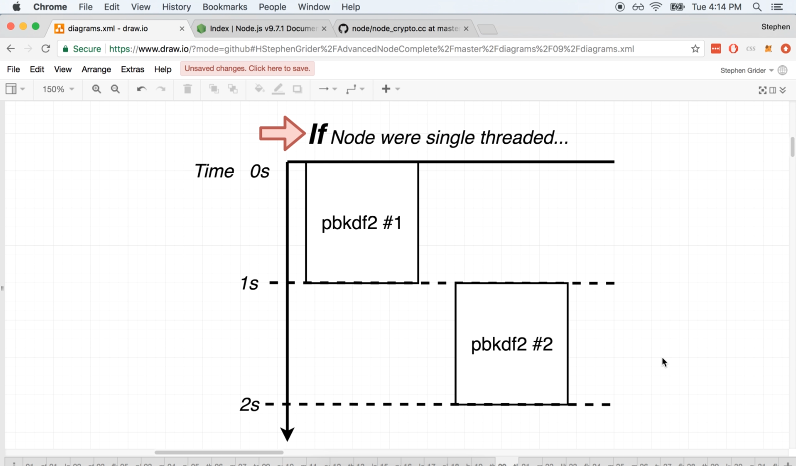

# DEV-08: Is Node Single Threaded?

## Tags: []

## Links: [<https://www.udemy.com/course/advanced-node-for-developers/learn/lecture/9636106#overview>, <https://www.udemy.com/course/advanced-node-for-developers/learn/lecture/9636108#overview>]

## Well is it?

    It is single threaded but thats not the full story

## Node.js vs the Node.js Event Loop

    To be precise, without a doubt, the Node.js event loop is single threaded.

    However. Some of the functions that are included inside of the standard library of node are not actually 
    single threaded.

## What?

    Some of the functions that are included inside of node
    actually run outside of the event loop and out of that single thread.

    Simply declaring that node is single threaded is not entirely true.
    The event loop uses a single thread, but somethimes the code that we write
    does not actually execute inside that thread entirely.
    Example of some standard node libraries that do this include: 
    - crypto

## What we would see if node was single threaded

