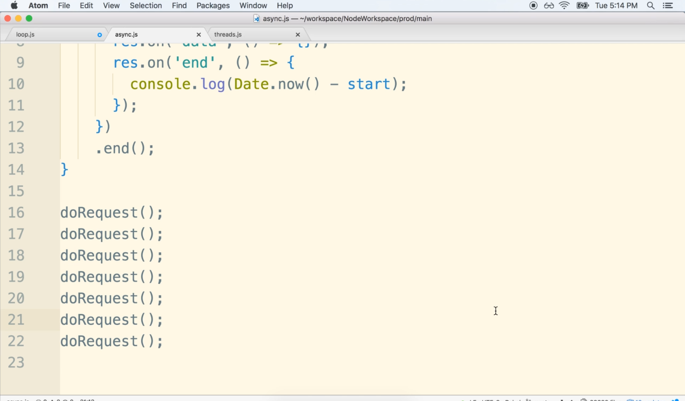

# DEV-10: Explaining OS Operations

## Tags: []

## Links: <https://www.udemy.com/course/advanced-node-for-developers/learn/lecture/9646732#overview>

## Making http requests

## How are all calls completed at the same time?

    By default, the tread pool has four threads.
    that means only four tasks can be processed at time.
    Here we have 6 task completed at the same time.

## Libuv strikes again

    unrealted to the thread pool, libuv has another pathway for this.
    Just as there are libraries that make use of the Libuv's thread pool,

    Node.js also has some functions that make use of the code thats is built 
    into the the underlying operating system through Libuv.

## Digging deeper

    Libuv sees that we are attempting to make an HTTP request.
    Neither Libuv nor Node.js has any code to handle all of the super low level
    operations that are involved with a network request.

    Instead Libuv delegates the request making to the underlying operating system.
    So it is actually our operating system that does th real Http request.

    Libuv is used to issue the request and then it just waits on the operating system to emit a signal that some response has come back to the request.

    So because the operating system is making the request, there is no blocking of our JavaScript code inside of our event loop or the thread pool at all in this case.
    

    
